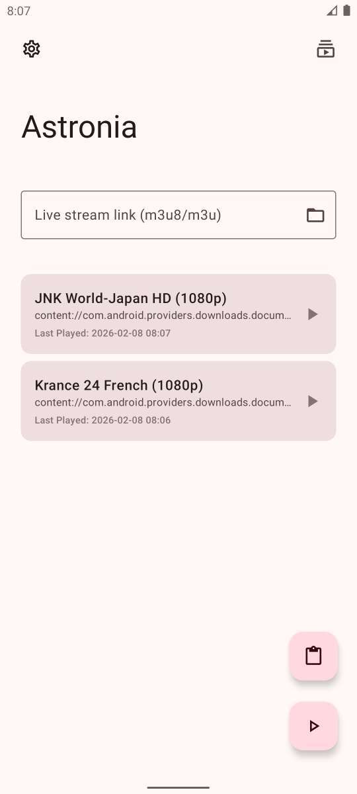
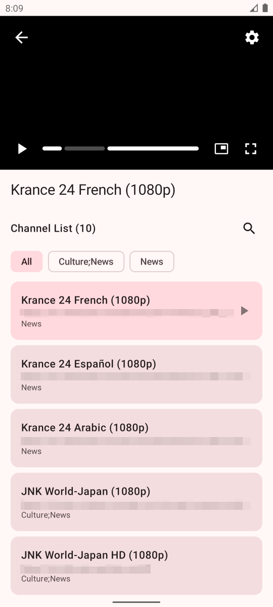
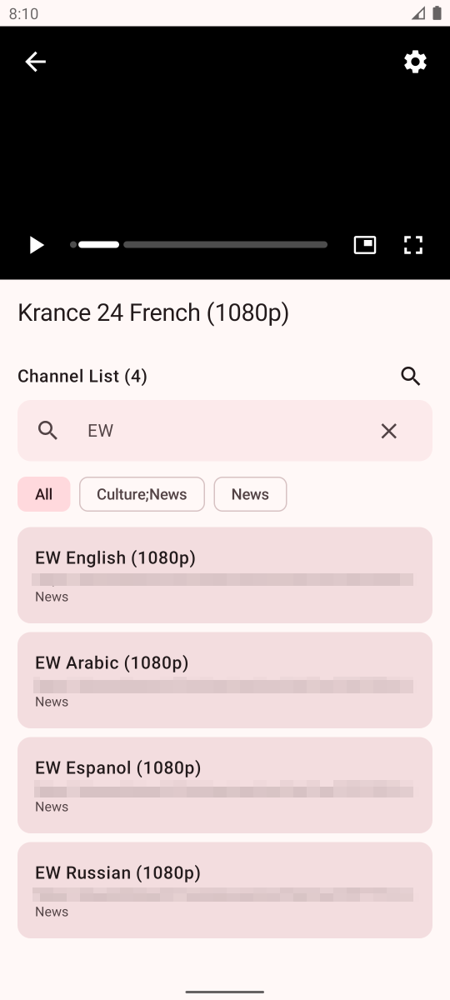
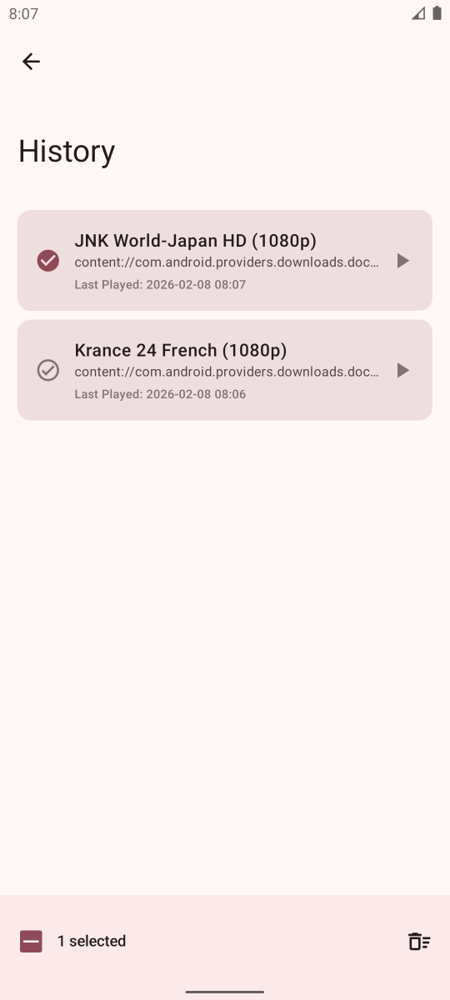
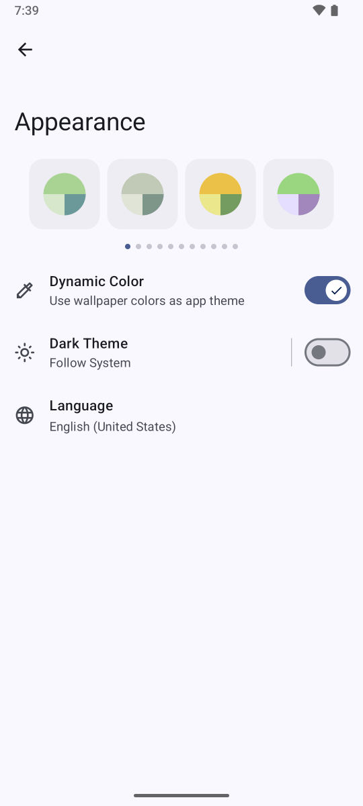
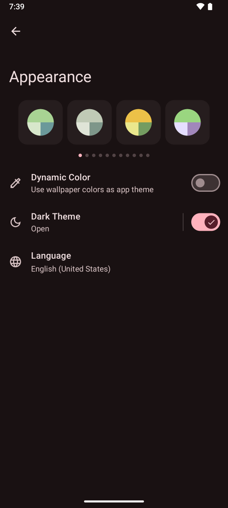

# Astronia

### 適用於 Android 的 M3U8 播放器

<a href="https://github.com/antoniegil/Astronia/blob/main/README.md">English</a>
&nbsp;&nbsp;| &nbsp;&nbsp;
<a href="https://github.com/antoniegil/Astronia/blob/main/README-zh_Hans.md">简体中文</a>
&nbsp;&nbsp;| &nbsp;&nbsp;
正體中文

Astronia 是一款輕量級的現代化的 Android M3U8 視訊播放器，採用 Material Design 3 設計。它提供簡潔直觀的介面，隨時隨地觀看IPTV直播。UI 設計靈感來自 [Seal](https://github.com/JunkFood02/Seal)。

## 📱 熒幕截圖

## 📖 功能特性

- 📱 Material Design 3 介面
- 🌙 深色模式支援
- 📺 子母畫面支援
- 🎬 解析度切換支援
- 🌐 多語言支援（30+）

## ⬇️ 下載

從 [IzzyOnDroid](https://apt.izzysoft.de/fdroid/index/apk/com.antoniegil.astronia) 下載以獲得自動更新。

## 🧱 致謝

UI 設計和實作深受 [Seal](https://github.com/JunkFood02/Seal) 啟發，許多元件和設計模式改編自其優秀的 Material Design 3 實作。

其他 UI 元素和設計概念借鑑自：
- [Read You](https://github.com/Ashinch/ReadYou)
- [Music You](https://github.com/Kyant0/MusicYou)

使用的函式庫和工具：
- [Jellyfin Media3 FFmpeg Decoder](https://github.com/jellyfin/jellyfin-androidx-media)
- [Material color utilities](https://github.com/material-foundation/material-color-utilities)
- [Monet](https://github.com/Kyant0/Monet)
- [Compose Markdown](https://github.com/jeziellago/compose-markdown)
- [Reorderable](https://github.com/Calvin-LL/Reorderable)

## ⚠️ 免責聲明

本軟體不提供任何直播內容，不內建任何訂閱源。使用者需自行承擔使用非法或未經授權內容源的法律後果，開發者不對此承擔任何法律責任。

## 📃 授權條款

>Copyright (C) 2026 Astronia
>
>本程式是自由軟體：你可以根據自由軟體基金會發布的 GNU 通用公共授權條款第三版或（根據你的選擇）任何後續版本的條款重新散布和/或修改它。
>
>本程式的發布是希望它能有用，但不提供任何保證；甚至不提供適銷性或特定用途適用性的默示保證。詳情請參閱 GNU 通用公共授權條款。
